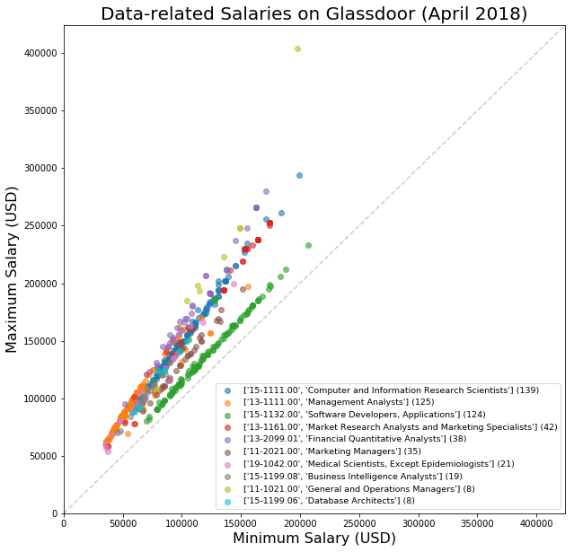

# Data Scientist job survey on Glassdoor.com

&nbsp;&nbsp;&nbsp;&nbsp;&nbsp;Curious about the current job market for data scientist roles, I wrote a bot to gather data satisfying the following conditions:

* full-time
* in NYC
* salary info available
* posted within past two weeks

&nbsp;&nbsp;&nbsp;&nbsp;&nbsp;Later slices made on star rating (minimum 3.5/5), postings including "Python" in the description, etc.  There appears to be a very stark separation between open source-y, Python & R type places and those using Excel, Hadoop, etc.  This was one of the more stark visuals to come out of this exploration:

